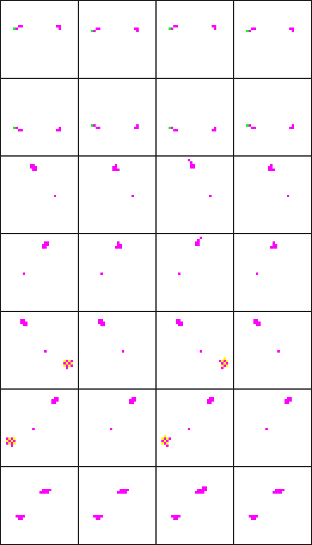

# Neko

A modern Linux port of the original Neko desktop pet from the NEC PC-9801, faithfully reverse-engineered from the NEKO.COM binary (v0.70 by \<tenten\> & naoshi).

An animated cat lives on your desktop and chases your mouse cursor. When it catches up, it scratches, falls asleep, and occasionally wanders off.

This uses the lesser-known original PC-9801 sprite art, not the more commonly recognized Macintosh/Windows sprites that most Neko ports are based on.

<p align="center">
  
</p>

## Requirements

- Python 3
- GTK 3 (usually pre-installed on Linux)
- [Pillow](https://pypi.org/project/Pillow/)
- AppIndicator3 (`libappindicator-gtk3` or equivalent)
- D-Bus (for Wayland cursor tracking on KDE)

## Running

```sh
python3 -m venv .venv --system-site-packages
source .venv/bin/activate
pip install Pillow
python neko.py
```

A system tray icon appears with a **Settings** menu for adjusting animation speed, movement speed, and sprite scale. Settings can be saved to `neko.json`.

## Compositor Support

Only tested on Fedora KDE Plasma (Wayland). Other environments are untested.

| Environment | Cursor Tracking | Notes |
|---|---|---|
| KDE Plasma (Wayland) | KWin script + D-Bus | Tested |
| Hyprland | `hyprctl cursorpos` | Untested |
| X11 (any DE) | GDK pointer query | Untested |
| GNOME (Wayland) | X11 fallback | Untested — cursor position may be stale over native Wayland windows |

## Credits

Original NEKO.COM by **\<tenten\> & naoshi** — binary sourced from [eliot-akira/neko](https://github.com/eliot-akira/neko/).
